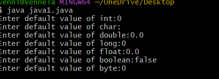
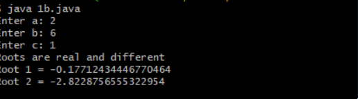

##EXPERIMENT-1
#1a)
```
#SOURCECODE:
class DisplayDefaultPrimitiveType {
  int PrimInt;
  float PrimFloat;
  char PrimChar;
  long PrimLong;
  double PrimDouble;
  boolean PrimBoolean;
  public static void main(String args[]) {
    DisplayDefaultPrimitiveType dDpt = new DisplayDefaultPrimitiveType();
    System.out.println("Default value of int: " +dDpt.PrimInt);
    System.out.println("Default value of float: " +dDpt.PrimFloat);
    System.out.println("Default value of char: " +dDpt.PrimChar);
    System.out.println("Default value of long: " +dDpt.PrimLong);
    System.out.println("Default value of double: " +dDpt.PrimDouble);
    System.out.println("Default value of boolean: " +dDpt.PrimBoolean);
    }
  }
```
#OUTPUT:



#1b)
```
#SOURCECODE:
import java.util.Scanner;
class QuadraticRoots {
  public static void main(String[] args) {
    double a,b,c,d,root1,root2;
    Scanner sc = new Scanner(System.in);
    System.out.print("Enter a: ");
    a = sc.nextDouble();
    System.out.print("Enter b: ");
    b = sc.nextDouble();
    System.out.print("Enter c: ");
    c = sc.nextDouble();
    d=b*b-4*a*c;
    if(d>0) {
      root1=(-b+Math.sqrt(d))/(2*a);
      root2=(-b-Math.sqrt(d))/(2*a);
      System.out.println("Roots are real and different");
      System.out.println("Root 1 = " +root1);
      System.out.println("Root 2 = " +root2);
      } else if(d==0) {
         root1=-b/(2*a);
         System.out.println("Roots are real and same");
         System.out.println("Root 1 = " +root1);
         } else {
            double real = -b/(2*a);
            double imag = Math.sqrt(-d)/(2*a);
            System.out.println("Roots are imaginary");
            System.out.println("Root 1 =" + real + " + " + imag + " i ");
            System.out.println("Root 2 =" + real + " - " + imag + " i ");
            }
            sc.close();
           }
}
```

