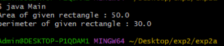
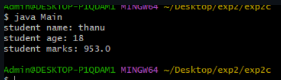

##EXPERIMENT-2
#2a)
```
#SOURCECODE:
nano Rectangle.java
class Rectangle {
  double length;
  double breadth;
  double area() {
    return length*breadth;
    }
    double perimeter() {
      return 2*(length+breadth);
      }
    }
nano Main.java
class Main {
  public static void main(String[] args) {
     Rectangle rect = new Rectangle();
     rect.length = 10;
     rect.breadth = 5;
     double area = rect.area();
     double perimeter = rect.perimeter();
     System.out.println("Area of given rectangle : " + area);
     System.out.println("perimeter of given rectangle : " + perimeter);
     }
   }
```
#OUTPUT:


#2b)
```
#SOURCECODE:
nano sum.java
class sum {
  int sum(int a,int b)  {
    return a+b;
    }
    int sum(int a,int b,int c) {
      return a+b+c;
      }
      double sum(double a,double b) {
        return a+b;
        }
      }

nano Main.java
class Main {
  public static void main(String args[]) {
    sum S = new sum();
    System.out.println("sum of 2 Integers : " + S.sum(30,20));
    System.out.println("sum of 3 Integers : " + S.sum(30,20,10));
    System.out.println("sum of 2 Integers : " + S.sum(30.456,20.678));
    }
  }
```
#OUTPUT:


#2c)
```
#SOURCECODE:

#SOURCE CODE:
nano stundent.java
class student {
  String Sname;
  int Sage;
  double Smarks;
  student(String name,int age,double marks) {
   Sname = name;
   Sage = age;
   Smarks = marks;
   }
   void display() {
   System.out.println("student name: " +Sname);
   System.out.println("student age: " +Sage);
   System.out.println("student marks: " +Smarks);
   }
}

nano Main.java
class Main {
  public static void main(String args[]) {
     student S = new student("thanu",18,953);
     S.display();
     }
   }
```
#OUTPUT:

