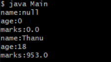
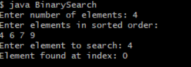
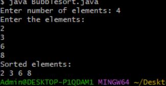

##EXPERIMENT-3
#3a)
```
#SOURCECCODE:
class student {
   String name;
   int age;
   double marks;
   student() {
   }
   student(String name,int age,double marks) {
   this.name = name;
   this.age = age;
   this.marks = marks;
  }
  void display() {
  System.out.println("name:" +name);
  System.out.println("age:" +age);
  System.out.println("marks:" +marks);
  }
}
class Main {
  public static void main(String args[]) {
  student std = new student();
  std.display();
  student std1 = new student("Thanu",18,953);
  std1.display();
  }
}
```
#OUTPUT:


#3b)
```
#SOURCECODE:
import java.util.Scanner;

public class BinarySearchExample {
    public static void main(String[] args) {
        Scanner sc = new Scanner(System.in);
        System.out.print("Enter number of elements: ");
        int n = sc.nextInt();
        int[] arr = new int[n];
        System.out.println("Enter elements in sorted order:");
        for (int i = 0; i < n; i++) {
            arr[i] = sc.nextInt();
        }
        System.out.print("Enter element to search: ");
        int key = sc.nextInt();
        int result = binarySearch(arr, key);
        if (result == -1) {
            System.out.println("Element not found");
        } else {
            System.out.println("Element found at index: " + result);
        }
        sc.close();
    }
    static int binarySearch(int[] arr, int key) {
        int low = 0;
        int high = arr.length - 1;
        while (low <= high) {
            int mid = (low + high) / 2;
            if (arr[mid] == key)
                return mid;
            else if (arr[mid] < key)
                low = mid + 1;
            else
                high = mid - 1;
        }
        return -1;
    }
}
```
#OUTPUT:


#3c)
```
#SOURCECODE:
import java.util.Scanner;

class BubbleSort {

    public static void main(String[] args) {
        Scanner sc = new Scanner(System.in);

        System.out.print("Enter number of elements: ");
        int n = sc.nextInt();

        int[] arr = new int[n];

        System.out.println("Enter the elements:");
        for (int i = 0; i < n; i++) {
            arr[i] = sc.nextInt();
        }
                for (int i = 0; i < n - 1; i++) {
            for (int j = 0; j < n - 1 - i; j++) {
                if (arr[j] > arr[j + 1]) {

                    int temp = arr[j];
                    arr[j] = arr[j + 1];
                    arr[j + 1] = temp;
                }
            }
        }


        System.out.println("Sorted elements:");
        for (int i = 0; i < n; i++) {
            System.out.print(arr[i] + " ");
        }

        sc.close();
    }
}
```
#OUTPUT:

