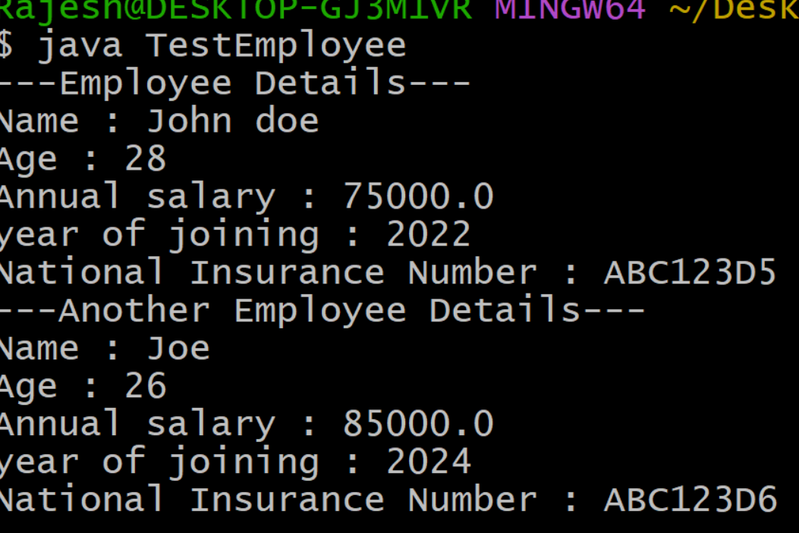
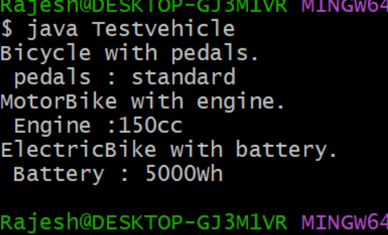

##EXPERIMENT-4
#4a)
```
#SOURCECODE:
class person {
  String name;
  int age;
  person(String name,int age) {
    this.name = name;
    this.age = age;
   }
    void displayPersonDetails() {
    System.out.println("Name : " +name);
    System.out.println("Age : " +age);
    }
  }
class Employee extends person {
  double annualSalary;
  int yearOfJoining;
  String NationalInsuranceNumber;
  Employee(String name,int age,double annualSalary,int yearOfJoining,String NationalInsuranceNumber) {
    super(name,age);
    this.annualSalary = annualSalary;
    this.yearOfJoining = yearOfJoining;
    this.NationalInsuranceNumber = NationalInsuranceNumber;
    }
      void displayEmployeeDetails() {
      displayPersonDetails();
      System.out.println("Annual salary : " +annualSalary);
      System.out.println("year of joining : " +yearOfJoining);
      System.out.println("National Insurance Number : " +NationalInsuranceNumber);
      }
    }
class TestEmployee {
  public static void main(String[] args) {
  Employee emp1 = new Employee("John doe",28,75000.0,2022,"ABC123D5");
  System.out.println("---Employee Details---");
  emp1.displayEmployeeDetails();
  System.out.println("---Another Employee Details---");
  Employee emp2 = new Employee("Joe",26,85000.0,2024,"ABC123D6");
  emp2.displayEmployeeDetails();
  }
}
```
#OUTPUT:



#4b)
```
#SOURCECODE:
class Bicycle {
  String pedalType = "standard";
  void showB() {
    System.out.println("Bicycle with pedals.\n pedals : " +pedalType);
    }
  }
class MotorBike extends Bicycle {
    int b = 150;
    void showM() {
      System.out.println("MotorBike with engine. \n Engine :" +b+"cc");
      }
    }
class ElectricBike extends MotorBike {
    int e = 5000;
    void showE() {
      System.out.println("ElectricBike with battery. \n Battery : " +e+"Wh");
      }
    }
   public class Testvehicle {
     public static void main(String args[]) {
       ElectricBike ebike = new ElectricBike();
       ebike.showB();
       ebike.showM();
       ebike.showE();
       }
     }
```
#OUTPUT:


#4c)
```
#SOURCECODE:
abstract class Figure {
  double d1,d2;
  Figure(double a,double b) {
    d1 = a;
    d2 = b;
    }
    abstract double area();
    }
    class Rectangle extends Figure {
      Rectangle(double l,double b) {
        super(l,b);
        }
        double area(){
        return d1*d2;
        }
      }
      class Triangle extends Figure {
         Triangle(double b,double h) {
          super(b,h);
        }
        double area() {
        return 0.5*d1*d2;
        }
      }
      public class TestFigure {
        public static void main(String args[]) {
          Figure f1 = new Rectangle(10,4);
          Figure f2 = new Triangle(10,8);
       System.out.println("Area of Rectangle = " +f1.area());
       System.out.println("Area of Triangle = " +f2.area());
      }
    }
```
#OUTPUT:

